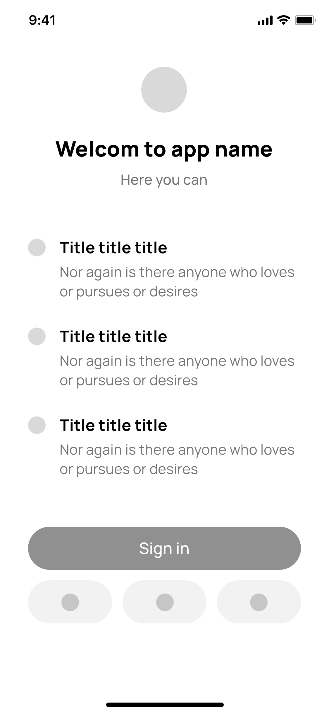
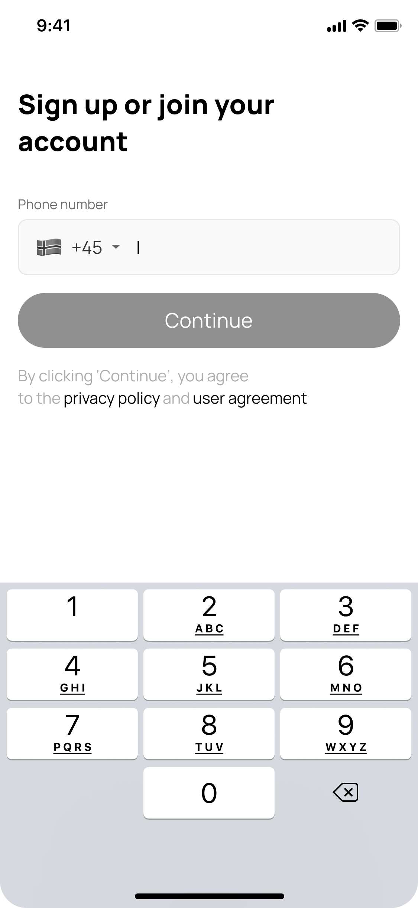
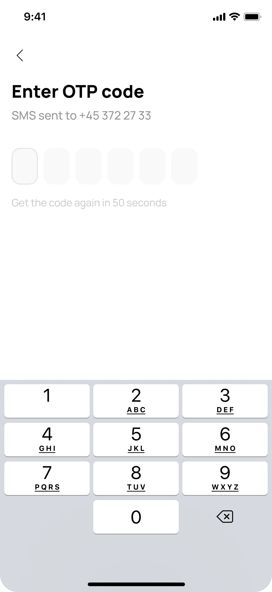
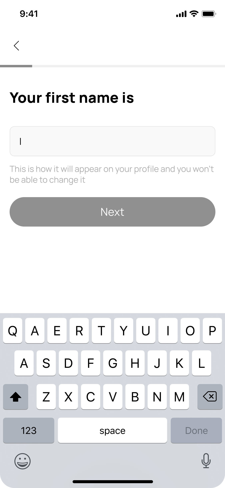
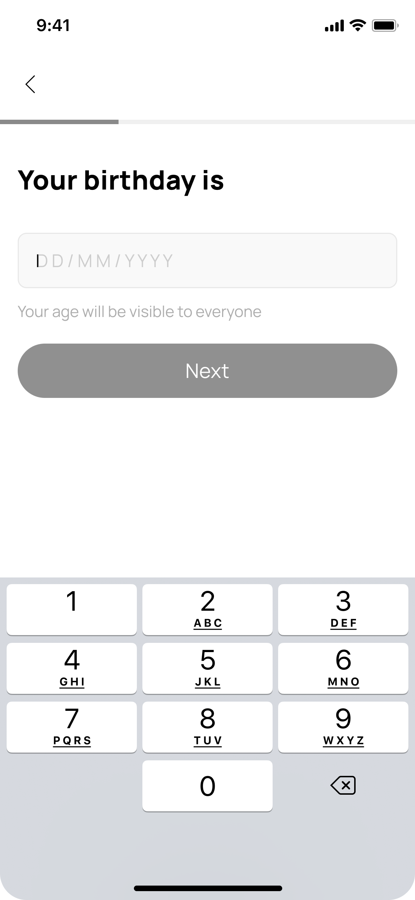
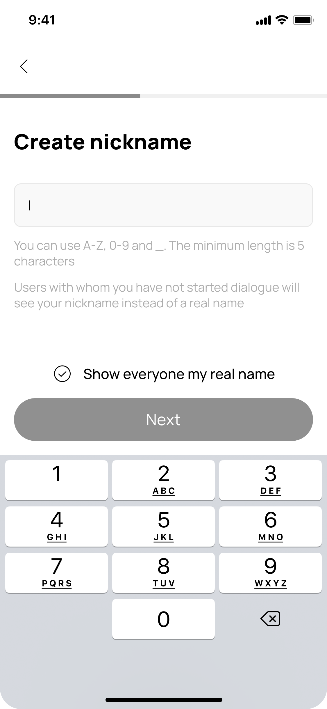
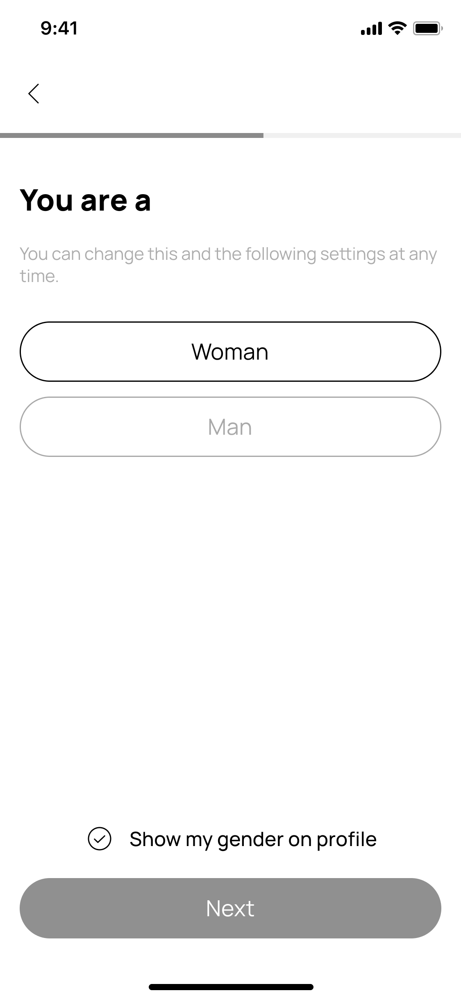
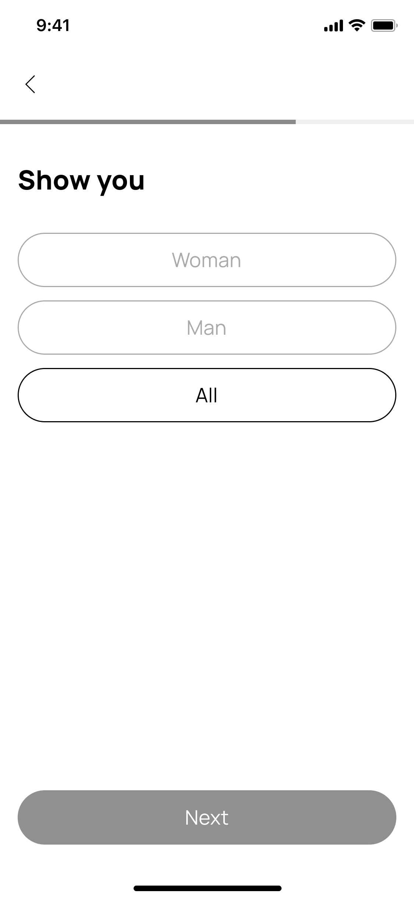

# Приложение со стажировки

## Что нужно было сделать?

Нужно было реализовать макет экранов регистрации пользователей в Tinder-подобном приложении для знакомств, при этом использовался State Management - *MobX* и инъекция зависимостей через *Provider*

Также требовалось реализовать логику работы с сервером на основе *JWT-токенов*, реализуя взаимодействие с сервером на основе REST API через библиотеку *Dio*, сохраняя при этом refresh-токен в защищенное хранилище используя библиотеку *secure storage*

## Что имели?

## Коммуникация с тим лидом
Тут было все очень просто
Раз в неделю можно было поспрашивать некоторые вопросы относительно архитектуры

Но основная работа и обучение было проведено в одиночку

### Макет в фигме с готовым дизайном

<table>
    <tr>
    <td></td>
    <td></td>
    <td></td>
</tr>
</table>
<!-- 
 
 -->

Дальше после ввода otp-кода происходит либо логин, либо дальнейшая регистрация

<table>
    <tr>
        <td></td>
        <td></td>
        <td></td>
    </tr>
    <tr>
        <td></td>
        <td></td>
</tr>
</table>
<!-- 

 -->

### Что получил по итогу?

Готовый проект, выполняющий все требуемые задачи(но работа с бэком была реализована только на макетах(в частности с pace-holderом, тк бэк по итогу не предоставили))

Запускайте, поглядите:)
