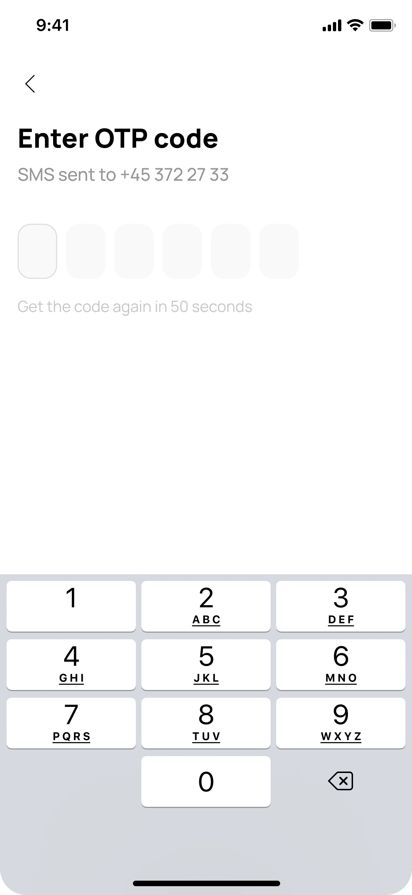

# Приложение со стажировки

## Что нужно было сделать?

Нужно было реализовать макет экранов регистрации пользователей в Tinder-подобном приложении для знакомств, при этом использовался State Management - *MobX* и инъекция зависимостей через *Provider*

Также требовалось реализовать логику работы с сервером на основе *JWT-токенов*, реализуя взаимодействие с сервером на основе REST API через библиотеку *Dio*, сохраняя при этом refresh-токен в защищенное хранилище используя библиотеку *secure storage*

## Что имели?

Макет в фигме с готовым дизайном

